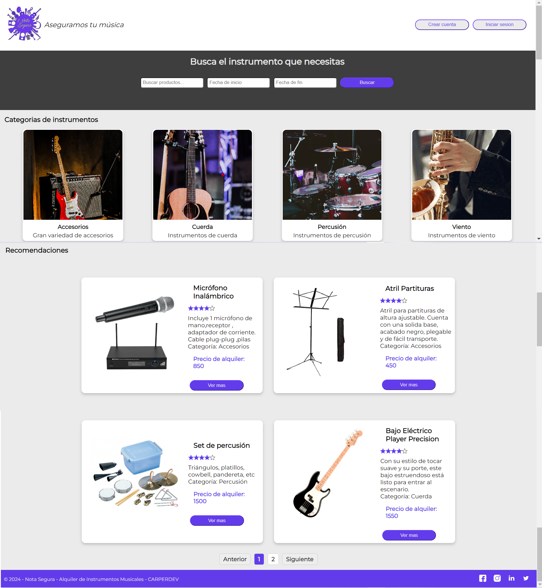
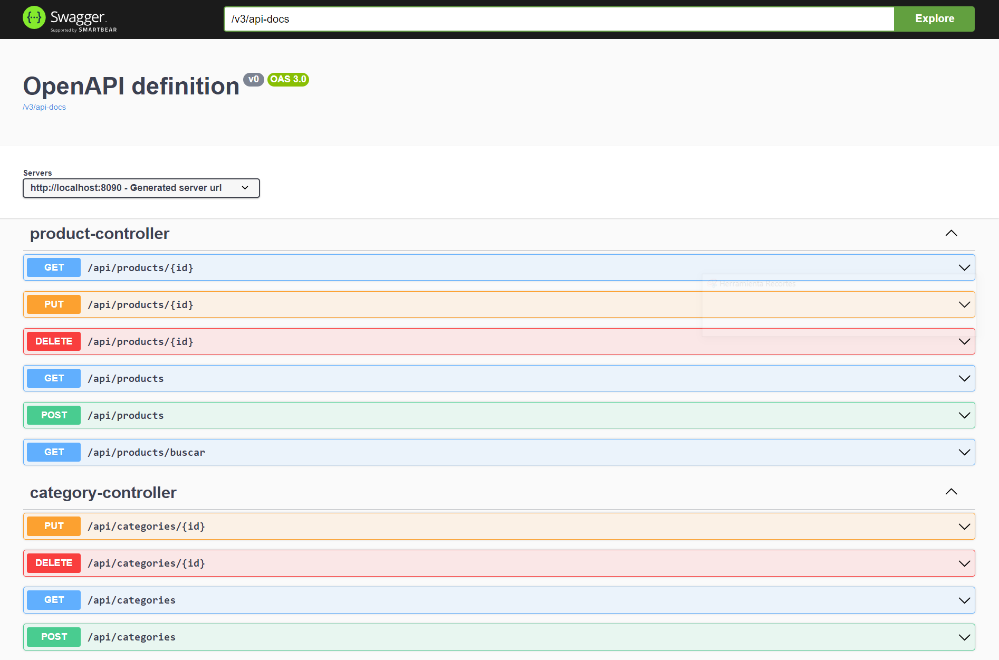

# Proyecto Integrador Nota Segura CARPERDEV

Aplicación para el alquiler de instrumentos musicales, que además permite la gestión de productos desde el panel administración.

## Funcionalidades
- Mostrar los instrumentos disponibles
- Busqueda de instrumentos
- Ver el detalle de cada instrumento
- Filtrar los instrumentos por categoria
- Gestión de instrumentos como usuario Administrador

## Demo

El video se encuentra dentro de recursos, puede ser necesario descargarlo para poder visualizarlo.

## Instalación y Ejecución

Se necesita Node.js y npm instalados. Luego, sigue estos pasos:

1. Clona este repositorio

2. Para la ejecución del Back end, importar el proyecto en IntelliJ y ejecutar la clase BackApplication.java. En http://localhost:8090/swagger-ui/index.html se puede ver la documentación de la API

3. Para la aplicación de Front end, abrir la carpeta en Visual Studio Code, instalar las dependencias con npm install y ejecutar el proyecto con npm run dev. La misma se abrirá en http://127.0.0.1:5173/

## Tecnologías Utilizadas
** Frontend

- Javascript
- React.js
- React Router
- Axios

** Backend

- Java
- Spring Boot
- JPA

** Database
- H2 SQL

** Testing

- Selenium WebDriver
- React Testing Library
- Jest
- Postman

** Version control

- Git
- Github

## Testing
Dentro de la carpeta Testing se encuentran las pruebas funcionales realizadas sobre la aplicación, tanto en la interfaz de usuario como en la API.

